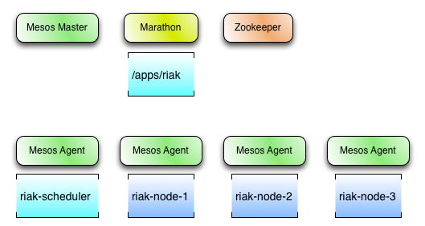
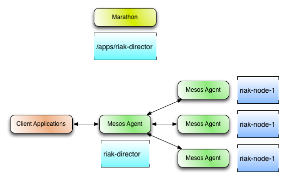

# Riak Mesos Framework

An [Apache Mesos](http://mesos.apache.org/) framework for [Riak TS](http://basho.com/products/riak-ts) and [Riak KV](http://basho.com/products/riak-kv/), a distributed NoSQL key-value data store that offers high availability, fault tolerance, operational simplicity, and scalability.

**Note:** This project is an early proof of concept. The code is a beta release and there may be bugs, incomplete features, incorrect documentation or other discrepancies.

## Installation

Please refer to the documentation in [riak-mesos-tools](https://github.com/basho-labs/riak-mesos-tools) for information about installation and usage of the Riak Mesos Framework.

# TODO Build

For build and testing information, visit [docs/DEVELOPMENT.md](docs/DEVELOPMENT.md).

## Architecture

The Riak Mesos Framework is typically deployed as a marathon app via a CLI tool such as [riak-mesos or dcos riak](https://github.com/basho-labs/riak-mesos-tools). Once deployed, it can accept commands which result in the creation of Riak nodes as additional tasks on other Mesos agents.

### Scheduler

The RMF Scheduler is written in erlang, using the mesos-master HTTP API. It maintains the current cluster configuration in Zookeeper (providing resilience against Scheduler failure/restart), and ensures the running cluster topology matches the configuration at all times. The Scheduler provides an HTTP API to mutate the cluster configuration, as well as running a copy of [Riak Explorer](https://github.com/basho-labs/riak_explorer) to monitor the cluster.

#### Resourcing

The Scheduler can be configured with several strategies for placement of Riak nodes, configurable via [constraints](#scheduler-constraints):

 - Unique hostnames: each Riak node will only be allowed on a mesos-agent with no existing Riak node
 - Distribution: spread Riak nodes across separate agents where possible
 - Host avoidance: avoid specific hosts or hostnames matching a pattern
 - Many more!
 
### Executor

The RMF Executor takes care of configuring and running a Riak node and a complementary [EPMD replacement](https://github.com/sanmiguel/erlpmd).

#### Inter-node Communication

Under normal operation, distributed erlang applications communicate with each other by first connecting on EPMD's default port, then communicating the necessary information for the nodes to connect. In a Mesos environment, however, it is not possible to assume that a specific port is available for use. To enable distributed erlang communication within Mesos, we use [ErlPMD](https://github.com/sanmiguel/erlpmd). ErlPMD listens on a port chosen by the Scheduler from those made available by Mesos and coordinates the ports each node can be reached at by storing it in Zookeeper.

# Fault Tolerance #

Being a distributed application, the Riak Mesos Framework consists of multiple components, each of which may fail independently. The following is a description of how the RMF architecture mitigates the effects of such situations.

The Riak Mesos Scheduler does the following to deal with potential failures:

* **Registers a failover timeout**: Doing this allows the scheduler to reconnect to the Mesos master within a certain amount of time.
* **Persists the Framework ID for failover**: The scheduler persists the Framework ID to Zookeeper so that it can reregister itself with the Mesos Master, allowing access to tasks previously launched.
* **Persists task IDs for failover**: The scheduler stores metadata about each of the tasks (Riak nodes) that it launches including the task ID in Zookeeper.
* **Reconciles tasks upon failover**: In the event of a scheduler failover, the scheduler reconciles each of the task IDs which were previously persisted to Zookeeper so that the most up to date task status can be provided by Mesos.

With the above features implemented, the workflow for the scheduler startup process looks like this (with or without a failure):

1. Check Zookeeper to see if a Framework ID has been persisted for this named instance of the Riak Mesos Scheduler.
   1. If it has, attempt to reregister the same Framework ID with the Mesos master
   2. If it has not, perform a normal Framework registration, and then persist the assigned Framework ID in Zookeeper for future failover.
2. Check Zookeeper to see if any nodes have already been launched for this instance of the framework.
   1. If some tasks exist and had previously been launched, perform task reconciliation on each of the task IDs previously persisted to Zookeeper, and react to the status updates once the Mesos master sends them
   2. If there are no tasks from previous runs, reconciliation can be skipped
3. At this point, the current state of each running task should be known, and the scheduler can continue normal operation by responding to resource offers and API commands from users.

***What happens when a Riak Mesos Executor or Riak node fails?***

The executor also needs to employ some features for fault tolerance, much like the scheduler. The Riak Mesos Executor does the following:

* **Enables checkpointing**: Checkpointing tells Mesos to persist status updates for tasks to disk, allowing those tasks to reconnect to the mesos agent for certain failure modes.
* **Uses resource reservations**: Performing a `RESERVE` operation before launching tasks allows a task to be launched on the same Mesos agent again after a failure without the possibility of another framework taking those resources before a failover can take place.
* **Uses persistent volumes**: Performing a `CREATE` opertaion before launching tasks (and after a `RESERVE` operation) instructs Mesos agents to create a volume for stateful data (such as the Riak data directory) which exists **outside** of the tasks container (which is normally deleted with garbage collection if a task fails).

Given those features, the following is what a node launch workflow looks like (from the point of view of the scheduler):

1. Receive a `createNode` operation from the API (user initiated).
2. Wait for resources from the Mesos master.
3. Check offers to ensure that there is enough capacity on the Mesos agent for the Riak node.
4. Perform a `RESERVE` operation to reserve the required resources on the Mesos agent.
5. Perform a `CREATE` operation to create a persistent volume on the Mesos agent for the Riak data.
6. Perform a `LAUNCH` operation to launch the Riak Mesos Executor / Riak node on the given Mesos agent.
7. Wait for the executor to send a `TASK_RUNNING` update back to the scheduler through Mesos.
   1. If the Riak node is already part of a cluster, the node is now successfully running.
   2. If the Riak node is not part of a cluster, and there are other nodes in the named cluster, attempt to perform a cluster join from the new node to existing nodes.

The node failure workflow looks like the following:

1. Scheduler receives a failure status update such as a lost executor, or a task status update such as `TASK_ERROR`, `TASK_LOST`, `TASK_FAILED`, or `TASK_KILLED`. 
2. Determine whether or not the task failure was intentional (such as a node restart, or removal of the node)
   1. If the failure was intentional, remove the node from the Riak cluster, and continue normal operation.
   2. If the failure was unintentional, attempt to relaunch the task with a `LAUNCH` operation on the same Mesos agent and the same persistence id by looking up metadata for that Riak node previously stored in Zookeeper.
3. If the executor is relaunched, the executor and Riak software will be redeployed to the same Mesos agent. The Riak software will get extracted (from a tarball) into the already existing persistent volume.
   1. If there is already Riak data in the persistent volume, the extraction will overwrite all of the old Riak software files while preserving the Riak data directory from the previous instance of Riak. This mechanism also allows us to perform upgrades for the version of Riak desired.
   2. The executor will then ask the scheduler for the current `riak.conf` and `advanced.config` templates which could have been updated via the scheduler's API.
   3. The executor can then attempt to start the Riak node, and send a `TASK_RUNNING` upate to the scheduler through Mesos. The scheduler can then perform cluster logic operations as described above.

## Director ##

Due to the nature of Apache Mesos and the potential for Riak nodes to come and go on a regular basis, client applications using a Mesos based cluster must be kept up to date on the cluster's current state. Instead of requiring this intelligence to be built into Riak client libraries, a smart proxy application named `Director` has been created which can run alongside client applications.

For more information related to the Riak Mesos Director, please read [docs/DIRECTOR.md](docs/DIRECTOR.md)

