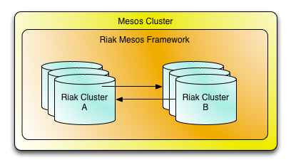
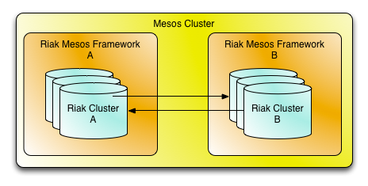
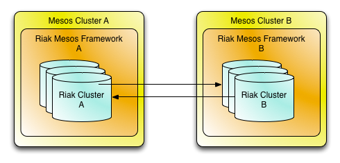

# Riak Mesos Framework: MDC (Proposal/WIP)

**NOTE**: This is a work in progress document to propose methods and architecture for connecting multiple RMF based Riak EE clusters for the purpose of Multi-Datacenter Replication. The format of the document is a tutorial / guide for setting things up as if the described features were already implemented.

When using the Riak Mesos Framework (RMF) to deploy several clusters of Basho's commercial offerings such as Riak KV Enterprise Edition (EE) or Riak TS EE, those clusters can be configured to communicate to enable multi-datacenter replication (MDC). 

For more information on Riak MDC architecture, please visit the [Riak KV Docs](http://docs.basho.com/riak/kv/2.1.4/using/reference/v3-multi-datacenter/architecture/).

The commands and configurations in this document assume a working installation of the [riak-mesos CLI tool](https://github.com/basho-labs/riak-mesos-tools).

## Use Cases

Riak MDC has a variety of uses and benefits including:

* Additional data redundancy for disaster recovery
* Geo locality of data for lower latency to end users
* Access pattern specific clusters to prevent expensive queries from impacting users

There are several system and network topologies that can be used for typical MDC use cases. Following are diagrams showing some of the ways that MDC can be configured with RMF.

* Single Mesos Cluster, Single RMF Instance




* Single Mesos Cluster, Multiple RMF Instances



* Multiple Mesos Clusters, Multiple RMF Instances




## Configuration and Setup

##### Framework A

Create a `riak-mesos` config specifying a unique `framework-name`.

`/etc/riak-mesos/config.json`

```
{
	"riak": {
		"framework-name": "framework-a",
		"...": "..."
	}
}
```

Create a Riak cluster.

```
riak-mesos cluster create --cluster cluster-a
riak-mesos node add --cluster cluster-a --nodes 3
```

##### Framework B

Create a `riak-mesos` config specifying a unique `framework-name`.

`/etc/riak-mesos/config.json`

```
{
	"riak": {
		"framework-name": "framework-b",
		"...": "..."
	}
}
```

Create a Riak cluster.

```
riak-mesos cluster create --cluster cluster-b
riak-mesos node add --cluster cluster-b --nodes 3
```

## Usage

### Connect Framework Instances

This step is only necessary when running multiple instances of RMF. If setting up MDC between two Riak clusters under a single framework instance, skip to the next section.

##### Framework A

Find the MDC address for `framework-a`.

```
riak-mesos framework endpoints
Framework HTTP API: http://mesos-cluster-a.com:31096/api/v1/
Framework Web UI: http://mesos-cluster-a.com:31096/api/v1/
Framework MDC: mesos-cluster-a.com:31096
```

##### Framework B

Connect `framework-b` to `framework-a` so that they can exchange cluster data.

```
riak-mesos framework connect --remote-address mesos-cluster-a.com:31096 --remote-framework framework-a
```

### Connect Riak Clusters

##### Framework A

List the local clusters.

```
riak-mesos cluster list
{"clusters":["framework-a"]}
```

##### Framework B

List the local clusters.

```
riak-mesos cluster list
{"clusters":["framework-b"]}
```

List the remote clusters, ensure it matches above.

```
riak-mesos cluster list remote
{"clusters":["framework-a"]}
```

Connect from `cluster-b` to `cluster-a`.

```
riak-mesos cluster repl connect --cluster cluster-b --remote-cluster cluster-a
```

### Realtime Replication

These commands can be run from `framework-a` or `framework-b`.

Enable and start realtime replication from `cluster-a` to `cluster-b`.

```
riak-mesos cluster repl realtime enable --source cluster-a --sink cluster-b
riak-mesos cluster repl realtime start --source cluster-a --sink cluster-b
```

Enable and start realtime replication from `cluster-b` to `cluster-a`.

```
riak-mesos cluster repl realtime enable --source cluster-b --sink cluster-a
riak-mesos cluster repl realtime start --source cluster-b --sink cluster-a
```

### Fullsync Replication

These commands can be run from `framework-a` or `framework-b`.

Enable and start fullsync replication from `cluster-a` to `cluster-b`.

```
riak-mesos cluster repl fullsync enable --source cluster-a --sink cluster-b
riak-mesos cluster repl fullsync start --source cluster-a --sink cluster-b
```

Enable and start fullsync replication from `cluster-b` to `cluster-a`.

```
riak-mesos cluster repl fullsync enable --source cluster-b --sink cluster-a
riak-mesos cluster repl fullsync start --source cluster-b --sink cluster-a
```

### Other Commands

```
riak-mesos cluster repl status
riak-mesos cluster repl realtime disable
riak-mesos cluster repl realtime stop
riak-mesos cluster repl fullsync disable
riak-mesos cluster repl fullsync stop
riak-mesos cluster repl cascades
riak-mesos cluster repl cascades always
riak-mesos cluster repl cascades never
riak-mesos cluster repl disconnect
riak-mesos framework disconnect
```